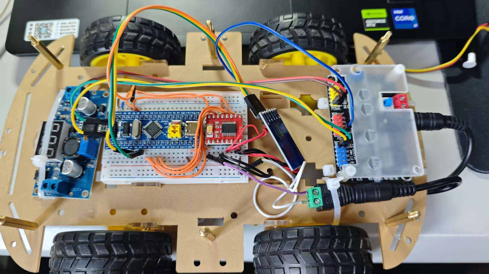
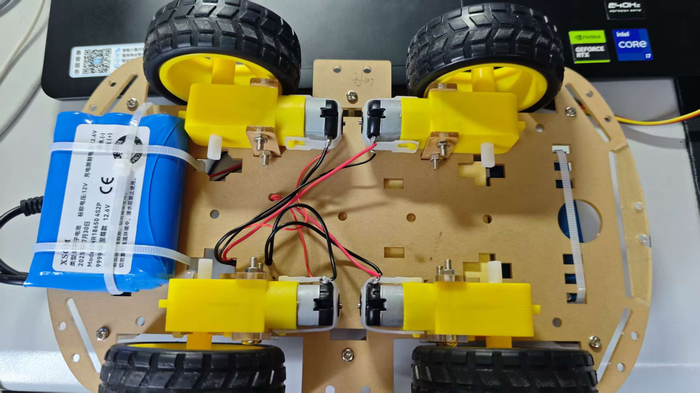

# 波特儿智能车控制固件 (STM32F103C8T6)
# 一个人瞎捣鼓的，不喜勿喷（✨(๑・̀ㅂ・́)و✧✨）
本项目是为基于 STM32F103C8T6 的小车底盘设计的嵌入式控制固件。它支持 5 路舵机和双路直流电机（TB6612 驱动），通过蓝牙（或串口）接收指令，实现舵机角度控制和电机速度调节。但是现在只对小车底盘进行了验证，可通过串口助手控制小车底盘的运动。  
实际上是要制作机械臂小车，**但是现在只对小车底盘进行了验证**（**机械臂的舵机部分可通过串口用VOFA+验证可行，但波特率需要改为115200**）


## 📦 硬件平台
+ 主控：STM32F103C8T6
+ 舵机：5 路 PWM 输出（TIM1 及 TIM2 各通道）
+ 电机驱动：TB6612，双路 PWM + 方向控制（TIM4）
+ 电源：三节装18650锂电池搭配dc-dc转换器（输出5V及3.3V以及可调节电压）
+ 通信：USART2（可接蓝牙模块 HC-06/JDY-31 或 USB 转 TTL）

##  🔌 引脚分配
| 功能           | 引脚   | 定时器/通道 | 备注                 |
|----------------|--------|-------------|----------------------|
| 舵机 1         | PA8    | TIM1_CH1    | -                    |
| 舵机 2         | PA9    | TIM1_CH2    | -                    |
| 舵机 3         | PA0    | TIM2_CH1    | -                    |
| 舵机 4         | PA1    | TIM2_CH2    | -                    |
| 舵机 5         | PB10   | TIM2_CH3    | -                    |
| 左电机 PWM     | PB6?   | TIM4_CH1    | 实际引脚请参考电路   |
| 左电机方向1    | PA4    | GPIO        | AIN1                 |
| 左电机方向2    | PA5    | GPIO        | AIN2                 |
| 右电机 PWM     | PB7?   | TIM4_CH2    | 实际引脚请参考电路   |
| 右电机方向1    | PA6    | GPIO        | BIN1                 |
| 右电机方向2    | PA7    | GPIO        | BIN2                 |
| 蓝牙 TX        | PA2    | USART2_TX   | 接模块 RX            |
| 蓝牙 RX        | PA3    | USART2_RX   | 接模块 TX            |
注意：PWM 引脚请根据实际电路确认，上述仅为示例。

## 📡 串口通信优化
原版固件采用简单的单字节中断接收，容易因主循环中的延时导致数据丢失。我们对串口接收部分进行了以下优化：

+ 环形缓冲区：中断将每个字节存入 128 字节的环形缓冲区，主循环空闲时再提取，彻底解决了丢包问题。

+ 行结束符兼容：同时支持 \n 和 \r 作为命令结束标志，并自动过滤空行。

+ 错误恢复：增加 HAL_UART_ErrorCallback，当发生 ORE（过载）等错误时自动清除标志并重启接收，提高通信稳定性。

+ 非侵入式修改：完全保留原有命令解析函数 Parse_Command，不改变任何业务逻辑。

## 📋 命令格式
固件通过串口接收 ASCII 字符串，支持两种命令格式（每条命令必须以换行符 \n 或 \r\n 结尾）：

1. 电机控制
```text
#M250,250
#M<左轮速度>,<右轮速度>
速度范围：-255 ~ +255，正数表示正转，负数表示反转。
```
示例：#M150,-150（左轮正转 150，右轮反转 150）

2. 舵机控制
```text
#<舵机ID>=<角度>
舵机 ID：1 ~ 5

角度范围：0 ~ 180 度

示例：#1=90（1 号舵机转到 90 度）
````
响应格式
固件收到命令后会通过串口回显，例如：
```TEXT
OK: Servo1 set to 90

Motor set: L=150, R=-150

Unknown command. Use #<id>=<angle> (e.g. #1=90)
```
## 🔧 使用说明
1. 硬件连接

将蓝牙模块（如 HC-06、JDY-31）或 USB 转 TTL 连接到 USART2 引脚（PA2/PA3），注意 TX-RX 交叉连接。

确保 GND 共地。

2. 波特率设置
固件（蓝牙jdy-31/hc-06）默认波特率为 9600，8 位数据，1 位停止位，无校验。如需修改，请更改 usart.c 中的 huart2.Init.BaudRate。

3. 发送命令

    + 用串口助手时无需修改波特率，直接发送命令即可。但是要追加换行符（用0A）
    + 使用串口调试助手（如 VOFA+、SSCOM）打开对应串口。（但是要修改cubemx的波特率为115200）
    + 务必勾选“发送新行”（即自动附加 \n 或 \r\n），否则多条命令会粘连，导致解析失败。或者追加换行符（用0A）
    + 输入上述格式的命令并发送，观察回显和硬件动作。

4. 调试技巧

    可通过板载 LED 或 printf 输出调试信息。
    + printf可是需要重定向的嗷！仔细观察我的main代码里由重定向

## 🚀 后续计划
当前固件已稳定，后续将：

基于 Flutter 开发跨平台的上位机 App，通过蓝牙控制小车，实现可视化遥控。

扩展更多功能，如 PID 调速、传感器数据回传等。

持续优化代码结构，完善文档。

## 🤝 贡献与反馈
欢迎 Star、Fork 或提交 Issue。如有任何问题或建议，请通过 GitHub 与我联系。

波特儿 出品
2026年3月

## 相关图片
### 小车正面
 
### 小车反面

